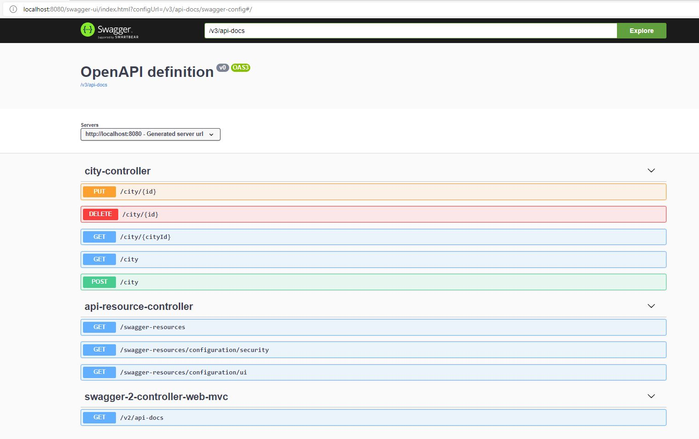

# ReslivTestBot
Application that service telegram bot. This bot can send to you information about city, whose name you send to him. Information stored in a database managed by REST API (Swagger). Available cities now is Minsk, Grodno, Vitebsk, Gomel.

## Built With
* 	[Maven](https://maven.apache.org/) - Dependency Management
* 	[OpenJDK](http://jdk.java.net/archive/) - Java™ Platform, Standard Edition Development Kit 
* 	[Spring Boot](https://spring.io/projects/spring-boot) - Framework to ease the bootstrapping and development of new Spring Applications
* 	[Swagger](https://swagger.io/) - Open-Source software framework backed by a large ecosystem of tools that helps developers design, build, document, and consume RESTful Web services.
* 	[Telegram Bots Api library](https://github.com/rubenlagus/TelegramBots) - Java library to create bots using Telegram Bots API.
## Running the application locally
There are several ways to run a Spring Boot application on your local machine. One way is to execute the `main` method in the `home.MyBootApplication` class from your IDE.
Alternatively you can use the [Spring Boot Maven plugin](https://docs.spring.io/spring-boot/docs/current/reference/html/build-tool-plugins-maven-plugin.html) like so:

```shell
mvn spring-boot:run
```
## Bot name and token
* 	Bot name is "@AlexLazarenkoTestBot"
* 	Bot token is "1965463710:AAFI0pLrJh0f7JuHYBiu-wXmG6Dyuae7WzU"

## Endpoints

|Method| 	Url		     | 	Description     |
|------| ----------- | -----------------|
|GET|/v2/api-docs    | 	swagger json    |
|GET|/swagger-ui.html| 	swagger html    |
|GET|/city         	| get list of cities|
|GET|/city/{cityId} | get city by id    |
|POST|/city         | create new city   |
|PUT|/city/{id}     | update city by id |
|DELETE|/city/{id}  | delete city by id |

Screenshot


